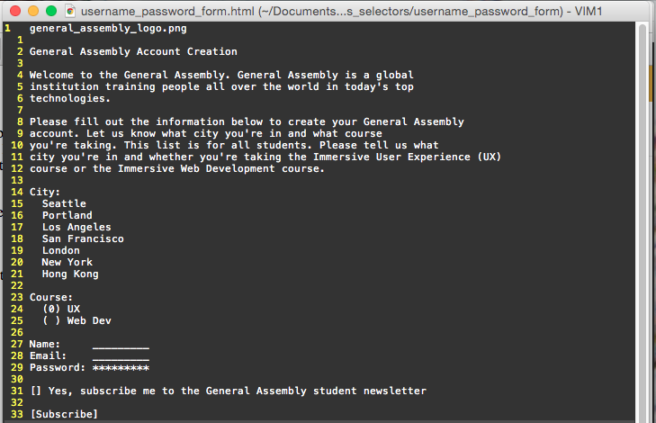
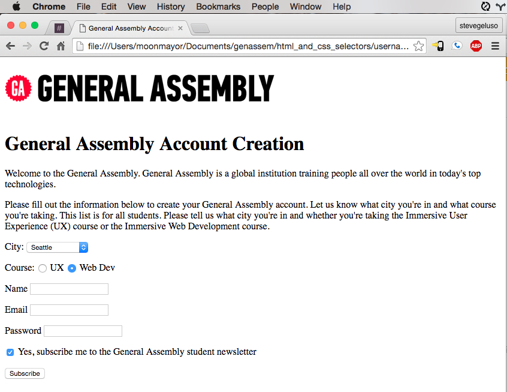

#HTML User Inputs

This exercise involves converting a given skeleton text file into a valid, interactive HTML page. The final webpage simulates a page where students create accounts for courses at General Assembly. Students select a city from a dropdown list, choose from one of two courses using a radio button, provide their name, their email, and a password, and have the option to uncheck an checkbox that automatically signs them up for a newsletter.

##Getting Started
* Fork and clone this repository to your computer
* Inspect the repository contents. Note that `skeleton.html` has a scaffold of the content you'll need

##Requirements
* The page title should be, **General Assembly Account Creation**
* The "Web Dev" radio button should be selected as default when the page loads.
* Anything entered in the password input should appear as hidden *'s
* The "yes" checkbox for subscribing to the newsletter should automatically be checked by default when the page loads.
* All of the inputs should be surrounded in a form that has an action pointing to a "success.html" page.
* Copy and paste your HTML into [the W3C HTML validator](https://validator.w3.org/#validate_by_input) and make sure it validates without errors

##Screenshot of the Skeleton

##Example Solution

